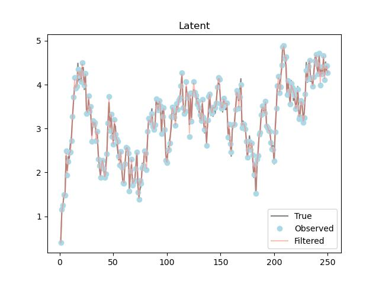

# About the project
pyfilter is a package designed for joint parameter and state inference in state space models using
particle filters and particle filter based inference algorithms. It's borne out of my layman's interest in Sequential 
Monte Carlo methods, and a continuation of my [Master's thesis](http://urn.kb.se/resolve?urn=urn:nbn:se:kth:diva-177104).

Some features include:
1. Particle filters in the form of [SISR](https://en.wikipedia.org/wiki/Particle_filter) and [APF](https://en.wikipedia.org/wiki/Auxiliary_particle_filter) together with different proposal distributions.
2. Both online and offline inference algorithms such as
   1. [SMC2](https://arxiv.org/abs/1101.1528) 
   2. [NESS](https://arxiv.org/abs/1308.1883)
   3. [SMC2FW](https://arxiv.org/pdf/1503.00266.pdf)
   4. [PMMH](https://www.stats.ox.ac.uk/~doucet/andrieu_doucet_holenstein_PMCMC.pdf)
   5. Variational inference targeting parameters coupled with particle filters for finding log-likelihood. 
3. [pytorch](https://pytorch.org/) backend enables GPU accelerated inference - what took hours on a CPU now takes minutes (or even seconds).

# Getting started
Follow the below instructions in order to get started with pyfilter.

## Prerequisites
Start by [installing pytorch](https://pytorch.org/get-started/locally/). 

## Installation
To install pyfilter just copy the below command into your favourite terminal 

```cmd
pip install git+https://github.com/tingiskhan/pyfilter
```

# Usage

All examples are located [here](./examples), but you'll find a short one below in which we define a sine diffusion 
process which we observe with some noise, and then back out using the APF together with the "optimal proposal"
distribution

```python
from stochproc import timeseries as ts, distributions as dists
import torch
from pyro.distributions import Normal
import matplotlib.pyplot as plt
from pyfilter.filters.particle import APF, proposals
from math import sqrt


def f(x, gamma, sigma):
    return torch.sin(x.values - gamma), sigma


def build_observation(x, a, s):
    return Normal(loc=a * x.values, scale=s)


dt = 0.1

gamma = 0.0
sigma = 1.0

init_dist = dists.DistributionModule(Normal, loc=0.0, scale=1.0)
inc_dist = dists.DistributionModule(Normal, loc=0.0, scale=sqrt(dt))

sine_diffusion = ts.AffineEulerMaruyama(f, (gamma, sigma), init_dist, inc_dist, dt=dt)

a = 1.0
s = 0.1

ssm = ts.StateSpaceModel(sine_diffusion, build_observation, (a, s))

sample_result = ssm.sample_states(250)
x, y = sample_result.get_paths()

fig, ax = plt.subplots()

ax.set_title("Latent")
ax.plot(sample_result.time_indexes, x, label="True", color="gray")
ax.plot(sample_result.time_indexes, y, marker="o", linestyle="None", label="Observed", color="lightblue")

filt = APF(ssm, 250, proposal=proposals.LinearGaussianObservations(0))
result = filt.batch_filter(y)

ax.plot(sample_result.time_indexes, result.filter_means.numpy()[1:], label="Filtered", color="salmon", alpha=0.5)
ax.legend()
```

<div align="center"> 
    
</div>

# Contributing

Contributions are always welcome! Simply
1. Fork the project.
2. Create your feature branch (I try to follow [Microsoft's naming](https://docs.microsoft.com/en-us/azure/devops/repos/git/git-branching-guidance?view=azure-devops)).
3. Push the branch to origin.
4. Open a pull request.

# License
Distributed under the MIT License, see `LICENSE` for more information.

# Contact
Contact details are located under `setup.py`.


